# CSV Upload

This space allows you to upload your .csv file with your products, match your column headers to our input data, select products from the file for description, choose parameters for the description, and populate the workspace with described products ready for .csv export.

**Note:** If you do not have a CSV file, click the “Download CSV Template” link. This will take you to our "CSV Templates" settings subpage, where you can download predefined e-commerce templates, create your own CSV template, or select your previously created and saved CSV templates.

<figure>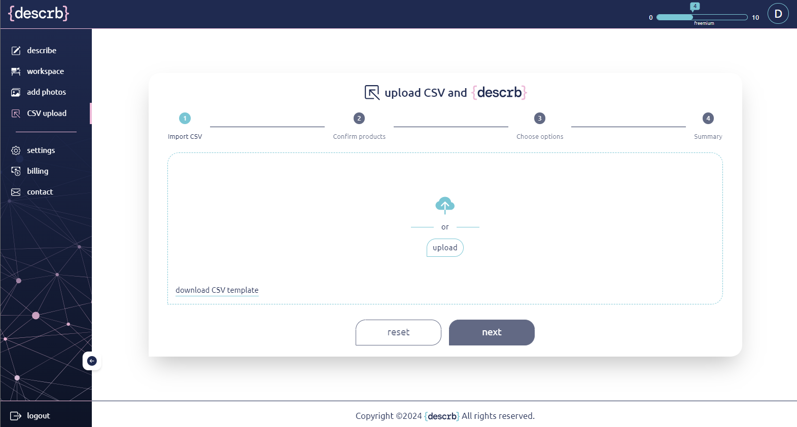<figcaption></figcaption></figure>

**Step 1: Upload File**

Use one of methods to upload your file: drag and drop from an open folder or upload the file selecting it via explorer from your device. After a successful import, click “Next.”

<figure>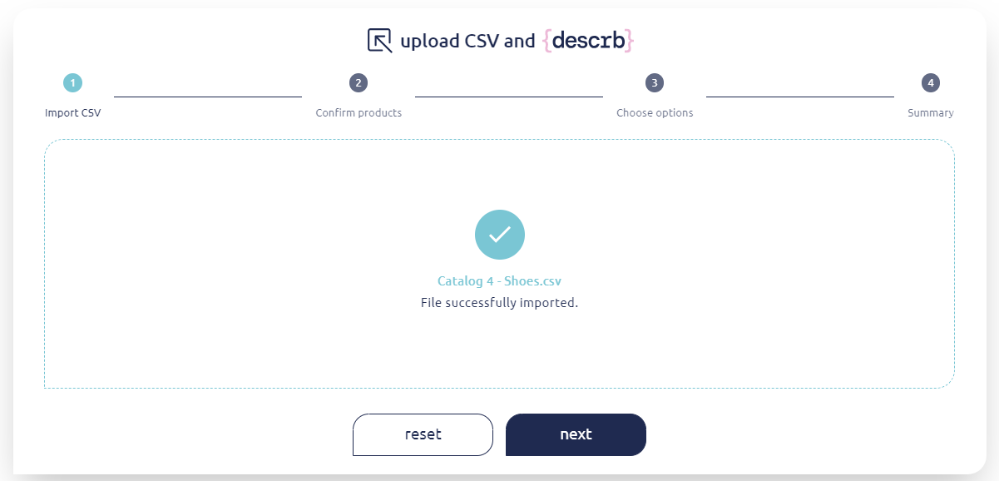<figcaption></figcaption></figure>

**Step 2: Confirm products**

Your CSV file's column headers will be displayed in two columns. Next to each of your column headers, there is a down arrow that reveals a drop-down menu with possible input data, analogical to those in the “Describe” section.

Note: At least one of the following inputs must be populated for the application to work: Photo, Product ID, or Name.

<figure>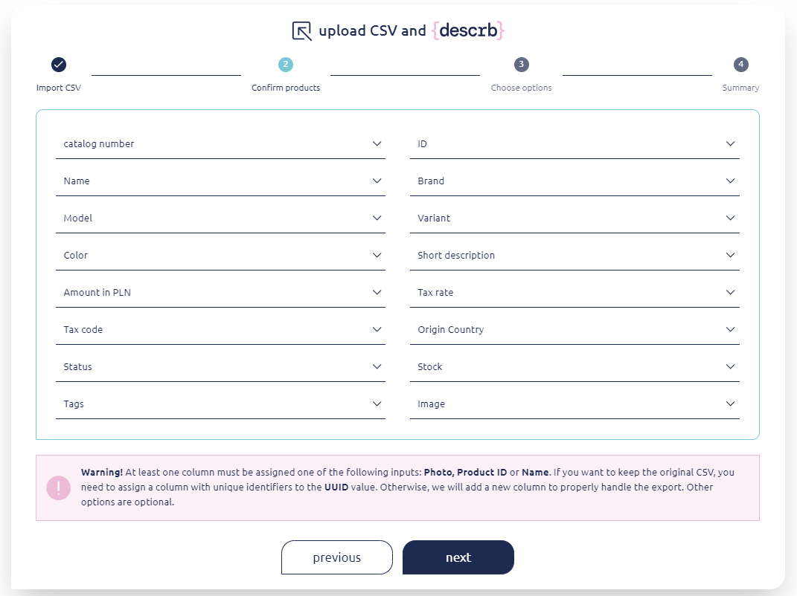<figcaption></figcaption></figure>

<figure>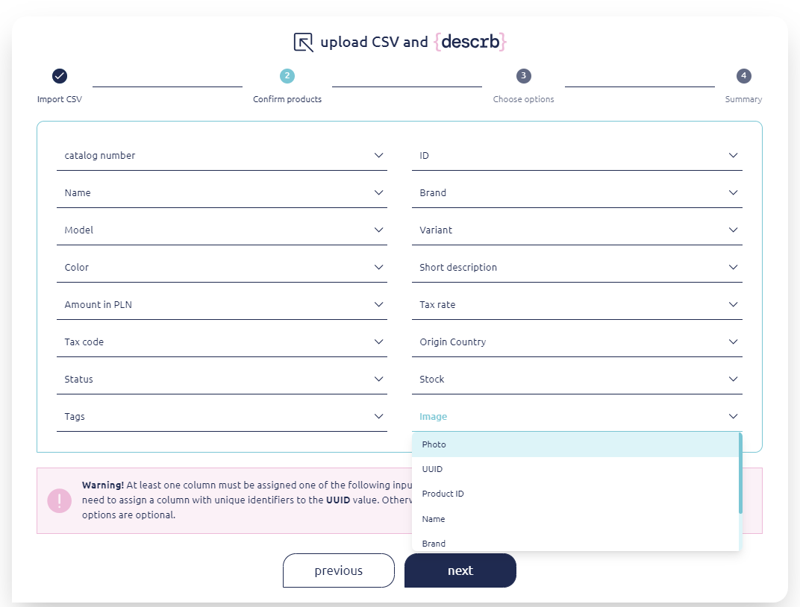<figcaption></figcaption></figure>

After matching your column headers to our input data, they will be displayed as pairs - your column header on top and our input data name below.

<figure>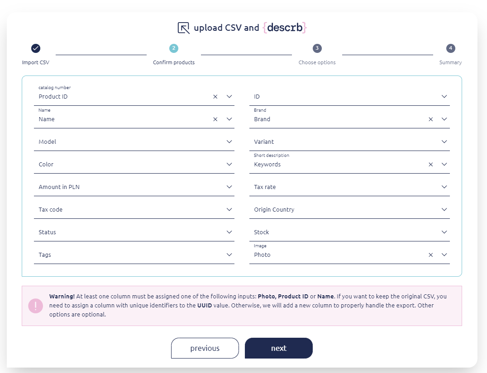<figcaption></figcaption></figure>

Once the input data is selected and assigned, it becomes an inactive option in the drop-down menu for another selection. It cannot be reassigned to another data point unless you cancel the previous link with an “x” in the previously paired line.

<figure>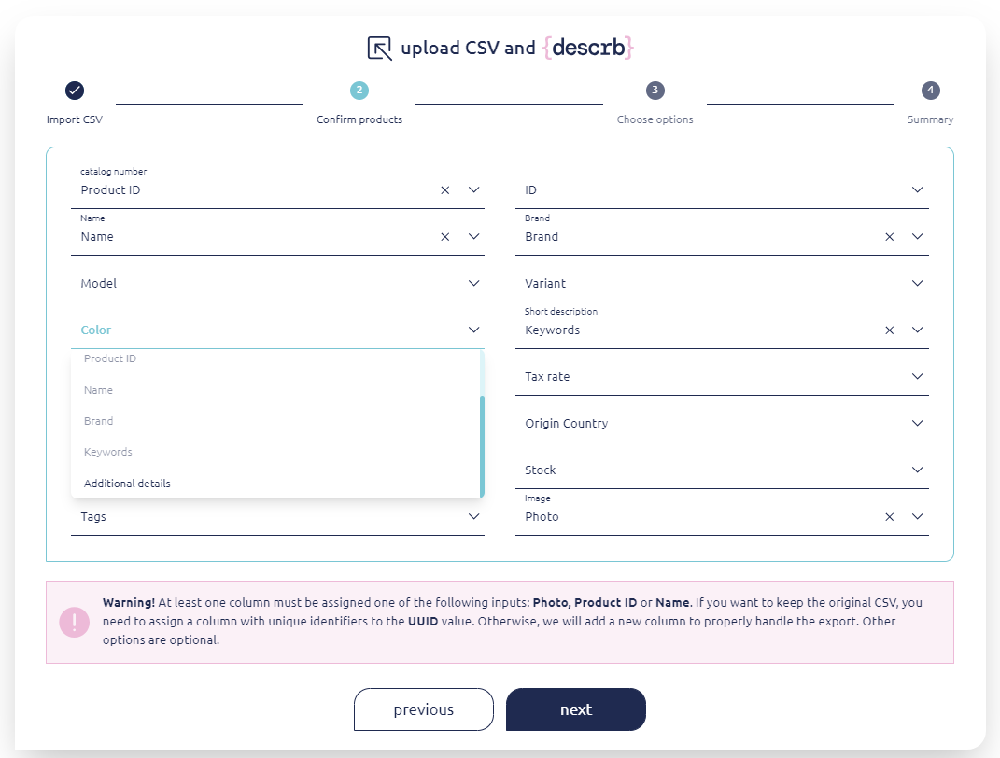<figcaption></figcaption></figure>

UUID is an unique identificatior number of the description generated in your workspace. If you are willing to keep the original CSV columns unmodified you need to assign UUID value to one of column headers. Otherwise in case of saving the file for export with description a new column with “UUID” header name will be added to your original CSV as a last column.

**Step 3: Choose options**

Choose additional parameters for the description, just like in the “Describe” section.

<figure>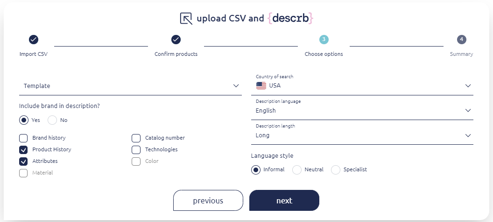<figcaption></figcaption></figure>

**Step 4: Summary**

Select with “Validation” column which product (lines) from your uploaded CSV file you’d like to describe. Select the items with a green tick button or mark products in bulk with checkboxes and use action from drop-down menu hidden under “action” button above the .

<figure>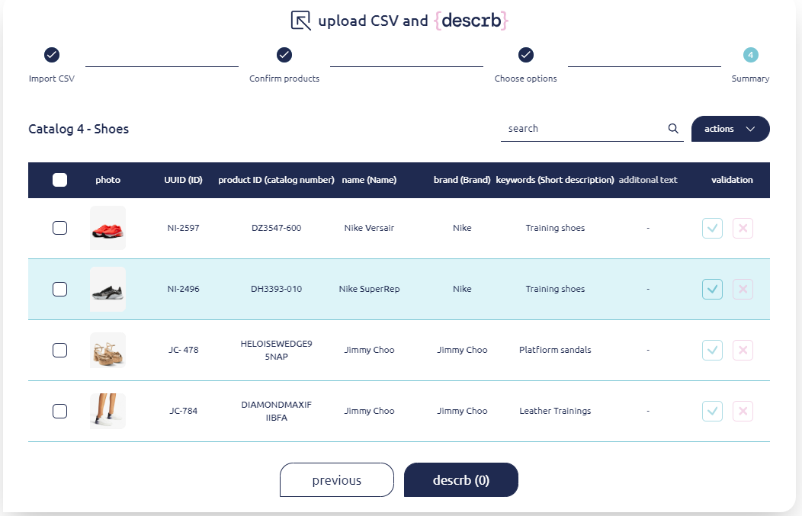<figcaption></figcaption></figure>

\
After product validation click “descrb” the total number of products selected for description will be displayed in brackets beside “descrb ( )”.

<figure>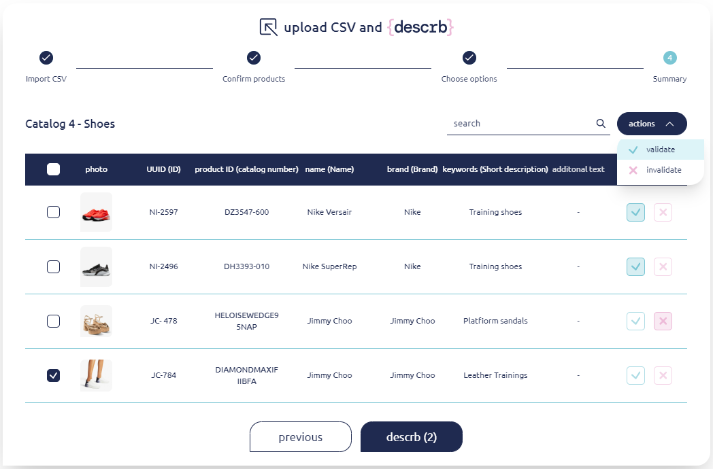<figcaption></figcaption></figure>

Before the descriptions are generated, you will be prompted for a final confirmation. Only the "validated" lines from your CSV file will be described, and this process cannot be undone.

Note: After confirmation, we will download an updated CSV file with an additional column named {describe ID}. Please do not modify its values, as they are needed to properly handle the export feature. You can later upload this file in the export popup if you want to use all the data not processed by our system.

<figure>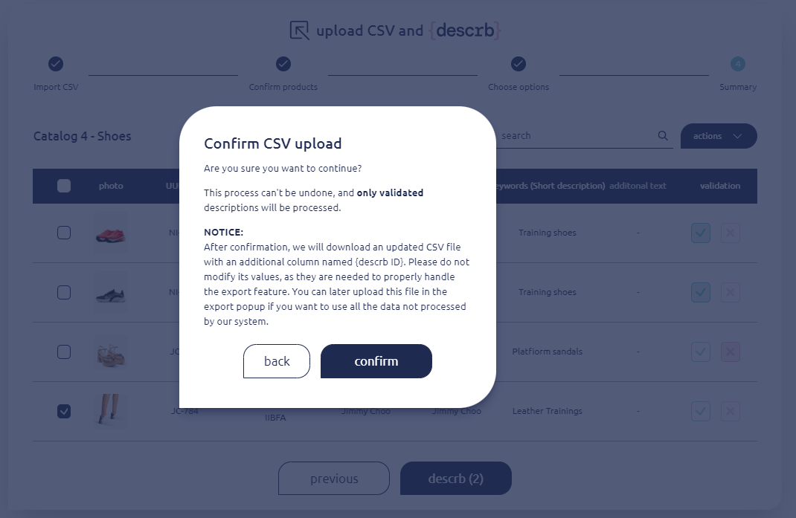<figcaption></figcaption></figure>

**Products descriptions in Workspace**

Selected product descriptions will be available in the "Workspace," where you will be redirected.

<figure>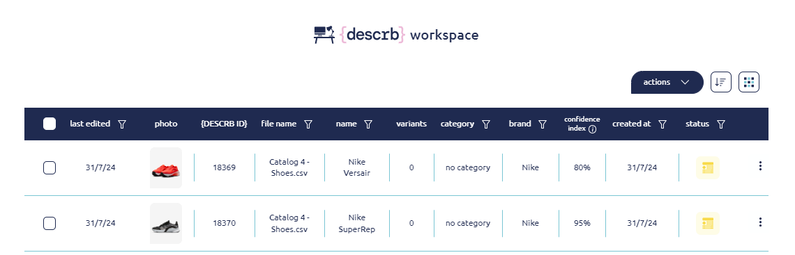<figcaption></figcaption></figure>

&#x20;
