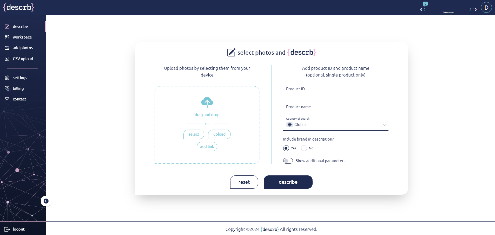
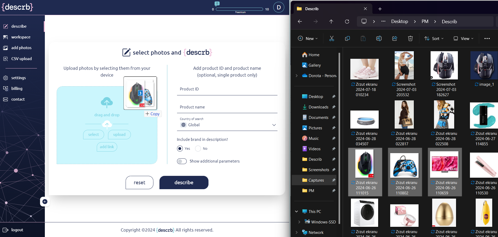
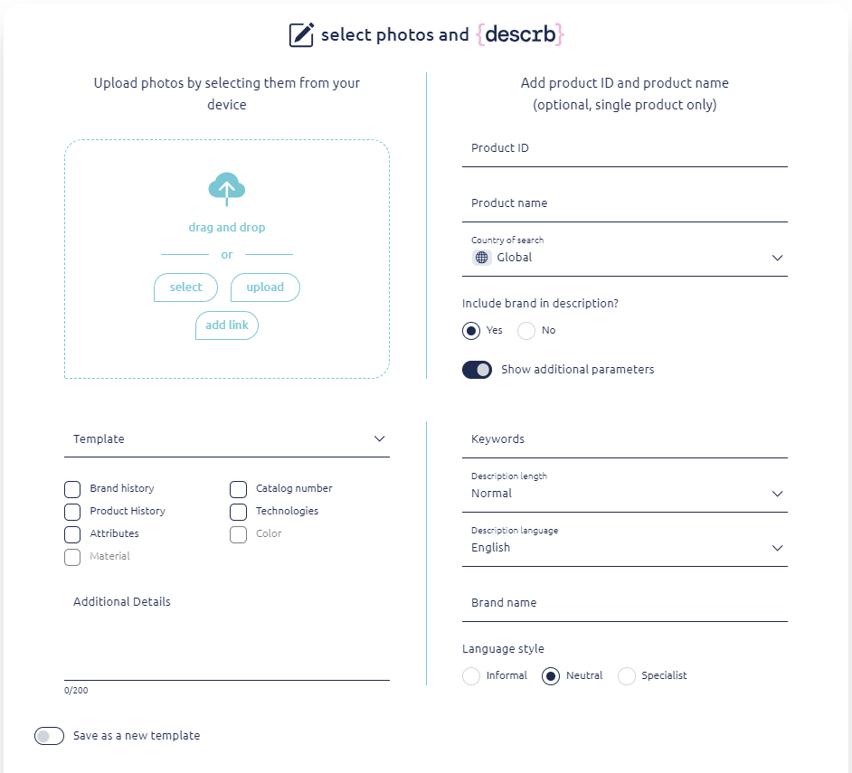

# Describe

Describe space is divided into sections: upload area and parameters area.

<figure><figcaption></figcaption></figure>

**Upload area** allows you to upload photo(s) in many different ways.&#x20;

* Drag and drop - from your devices opened folder
* Select - from the “add photo” section in the app
* Upload - searching through folders available on the device
* Add link - paste copied links (URLs) of images

<figure><figcaption></figcaption></figure>

<figure><figcaption></figcaption></figure>

After uploading some pictures you can upload more pictures with the upload icon in the top right corner of the upload area.

&#x20;

**Parameter area**

* add product name (optional only for single product description) - to help find the perfect description
* product ID (optional only for single product description) - to help find the perfect description
* country of search&#x20;
* include brand description - this parameter defines if the product description will be generic or if the brand name is mentioned

<figure><figcaption></figcaption></figure>

&#x20;

**Additional parameters area** will be revealed after clicking “show additional parameters” toggle

* Template - reveals a drop down menu of previously saved and named description&#x20;

templates based on all selected parameters.

* Brand history (parameter is available only if “brand included” was earlier allowed)
* Product history (parameter is available only if “brand included” was earlier allowed)
* Catalog number (parameter is available only if “brand included” was earlier allowed)
* Technologies (parameter is available only if “brand included” was earlier allowed)
* Attributes
* Color (parameter is available only if the brand is excluded from the description)
* Material (parameter is available only if the brand is excluded from the description)
* Additional detail - information that should be included in the description.
* Keywords - words that must be included in description - write the word and confirm it with “+” button or enter
* Description length - select from the dropdown menu from short, normal, long and unlimited
* Description language - select from dropdown list of languages available
* Brand - if the brand is not obvious and we want to help better search it for description
* Language style - select the style of the description from informal, neutral and specialist
* Save as a new template - this toggle enables to save the configuration of selected parameters and create a new template that will be available for future use. If the toggle for saving the template is on the additional line will appear enabling naming new template.&#x20;


If a template was already chosen from the template list this toggle will change to “update current template” and adjust its name. After clicking describe all changes will be saved.


<figure><figcaption></figcaption></figure>


It is possible to select whole bundles of photos but it is important to remember that the parameters chosen in the second area will apply to all the photos described in this bundle. It is possible to describe up to 20 photos with the same parameters at once.

