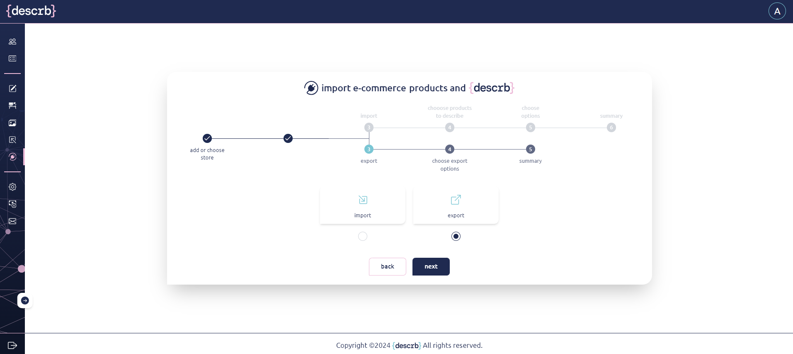

# E-commerce

This space enables you to seamlessly integrate your e-commerce platform with {descrb}.

<figure><figcaption></figcaption></figure>

**Creating and connecting e-commerce**

To create a new store avatar, click the “+” button located in the center of the e-commerce page, just below the process graph.

\
Enter the store name, select your e-commerce platform, and click the “Add” button to confirm. If you wish to cancel, simply click the “Cancel” button to exit the process.

<figure><figcaption></figcaption></figure>

After creating the store, it must be connected to your e-commerce platform.

\
Select the store by clicking on its avatar, then click the “Next” button located at the bottom of the screen.

<figure><figcaption></figcaption></figure>

To proceed and work with the products from your store it is required to log into the e-commerce platform. Fill in the URL link to the store and click “connect” button.

<figure><figcaption></figcaption></figure>

Log into your e-commerce platform.

<figure><figcaption></figcaption></figure>

You will be notified about the access that will be shared, and your approval will be required.

<figure><figcaption></figcaption></figure>

Once this action is complete, your store will be connected, allowing you to import products to enhance their descriptions and export them back to your store.

**Importing products from your e-commerce**

After you have your store connected choose e-commerce platform you’d like to work on and click “next”.

<figure><figcaption></figcaption></figure>

Then select import option and click “next”.

<figure><figcaption></figcaption></figure>

All products from your store will be imported and listed. Select the products you’d like to work on.

<figure><figcaption></figcaption></figure>

If multiple products are imported, they will appear across additional pages of the list.\
You can also customize the number of products displayed per page.

\
Once you have selected all the products you want to describe, click “Next.”

<figure><figcaption></figcaption></figure>

In the next step, you will be prompted to select the details for your description. Confirm your selection by clicking the “Next” button.

<figure><figcaption></figcaption></figure>

Afterward, a summary will be displayed, allowing you to edit each field in the matrix.\
You can delete, modify, or add input search information to ensure that specific keywords or additional details are included in the description. Please note that only the product image is required to generate a complete description.

In this step, it is important to confirm your selection of products for the description and the input data in the matrix. You can do this by clicking the green tick in the validation column or use the checkboxes on the right side to bulk validate. Choose one of the available actions: “Validate” or “Invalidate.”

<figure><figcaption></figcaption></figure>

After making sure which products are selected by validating them click “descrb” button.

<figure><figcaption></figcaption></figure>

Only “Validated” products will be described.

Once you click the "descrb" button, your choices cannot be undone, and the number of remaining descriptions will decrease by the amount shown in the brackets on the "descrb" button

Before the description generation, you will be asked to confirm your decision

<figure><figcaption></figcaption></figure>

After clicking the "Confirm" button in the confirmation dialog, you will be automatically redirected to the Workspace page, where all the imported and described products will appear.

<figure><figcaption></figcaption></figure>

&#x20;

**Exporting products to your e-commerce**

After describing the product, you can work on the description in the Workspace by editing all the generated content.

\
You can also change the main product image to your preference using our AI-supported Photo Editor, available in the Add Photos area.

<figure><figcaption></figcaption></figure>

When you decide that the product description is ready to be published on your e-commerce site, select "Export" in the E-commerce tab and click the "Next" button.

<figure><figcaption></figcaption></figure>

Next, choose whether you’d like to “Export and Replace” previously imported items or “Export as New” items on the selected e-commerce platform.

<figure><figcaption></figcaption></figure>

**Export as new**

Select the products from the list of items available in your Workspace area by validating them, and then click the "Next" button.

<figure><figcaption></figcaption></figure>

Only validated products will be exported and will create new products on our e-commerce.

<figure><figcaption></figcaption></figure>

&#x20;

**Export and replace**

\
Select the products from the list of items that were previously imported from your e-commerce, as they are internally linked with the descriptions generated in the Workspace. Validate them and click the "Next" button.

<figure><figcaption></figcaption></figure>

Only validated products will be exported and replaced in the chosen e-commerce.

<figure><figcaption></figcaption></figure>

After clicking "Next," the items will be created and displayed on your e-commerce platform.
