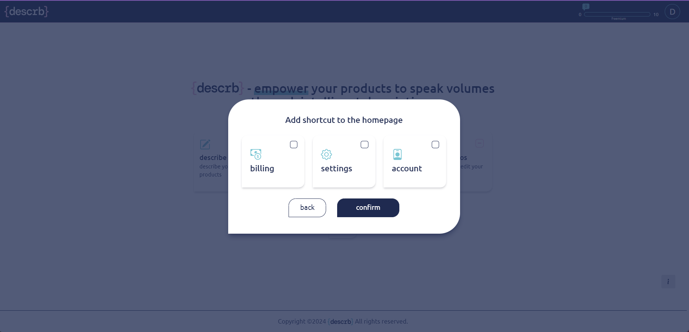

# Home page/ Dashboard

**Shortcuts**&#x20;

Home page consists of tiles that are shortcuts redirecting the user to different subpages. By default there are four tiles: “describe”, “csv upload”, “go to workspace” and “add photos”.

<figure><figcaption></figcaption></figure>

The user can insert additional shortcuts to his home page by utilizing the “+” button.

<figure><figcaption></figcaption></figure>

Shortcuts can be removed from the dashboard page dashboard with a “-” button placed in the right corner of the tile.

<figure><figcaption></figcaption></figure>
