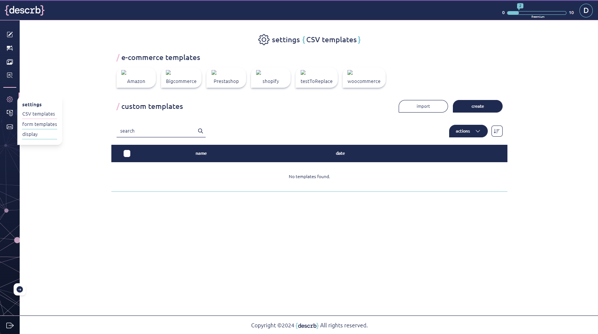

# Navigation

As soon as any shortcut is clicked the user will be redirected to the subpage with a foldable left sided menu. The user can fold and unfold the menu with an arrow placed in the bottom left corner of the page.

The menu contains links to four core spaces:

* describe
* workspace
* add photos
* CSV upload

and additional spaces for your convenience:

* settings
  * CSV templates
  * form templates
  * display
* billing
* contact
* logout - on the bottom of the menu


The left sided menu is fully available under icons after folding. Settings subpages are available from the icons view after a single click in settings icon.


<figure><figcaption></figcaption></figure>
