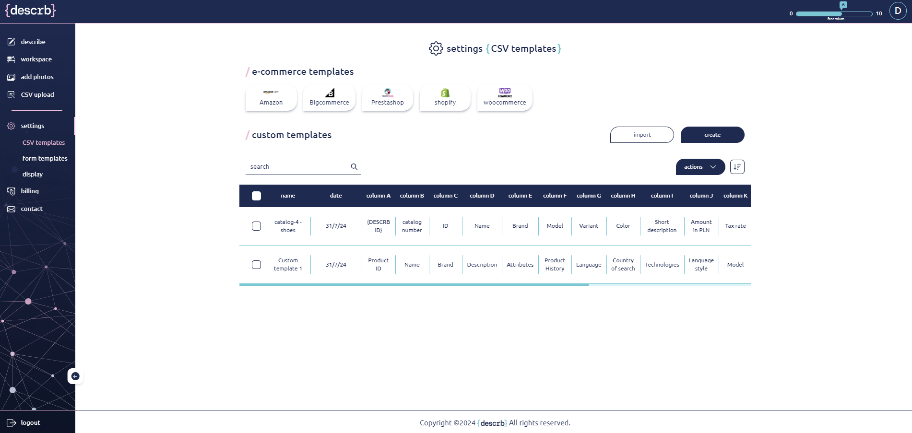

# CSV templates

Upload existing product descriptions using .csv files and adjust the columns to match {describe} parameters. Alternatively, download a shop-specific or previously saved template to upload the products directly to your Workspace.

Create your own CSV template tailored to your individual needs or download one of the predefined shop-specific templates.

<figure><figcaption></figcaption></figure>

Once the upload is complete, the products from the .csv file will be transferred directly to your Workspace and will be available for further editing.

&#x20;
