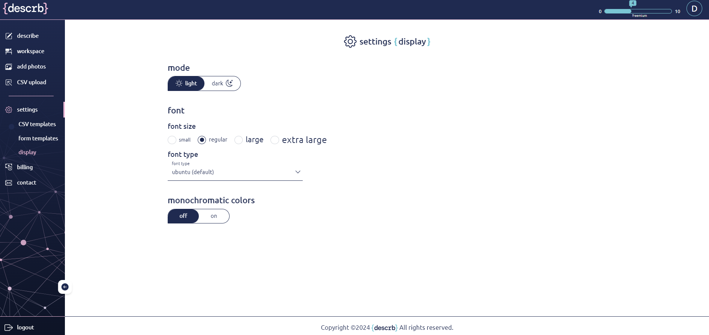

# Display

#### Accessibility Modes 

We believe in making our app accessible to everyone. That's why we've included several accessibility modes to cater to different needs:

1. **Dark Mode:** Reduce eye strain and save battery life by switching to Dark Mode. This mode uses dark backgrounds with light text, making it easier to view in low-light environments.
2. **Font Size and Style:** Customize the font size and style to enhance readability. Whether you prefer larger text for better visibility or a specific font style that suits your reading comfort, you can adjust these settings to fit your preferences.
3. **Monochromatic Mode:** For users with color vision deficiencies or those who prefer a high-contrast, single-color scheme, Monochromatic Mode simplifies the color palette to enhance clarity and contrast, making it easier to distinguish between different elements on the screen.

<figure><figcaption></figcaption></figure>

These accessibility options ensure that our app is user-friendly and inclusive, providing a better experience for everyone.
