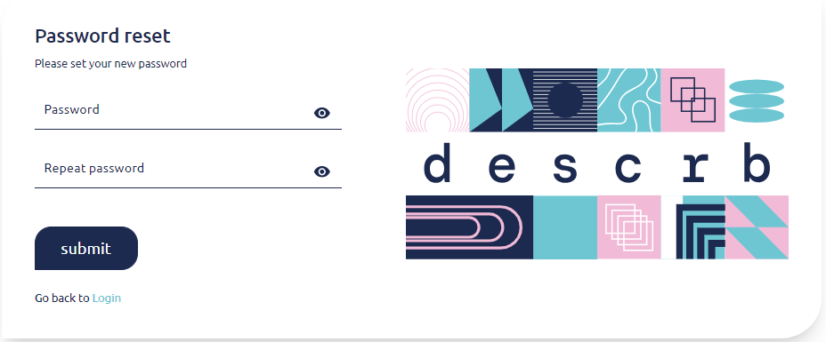

# Sign up/ Log in / Password recovery

**Sign up**\
During first visit the user needs to sign up. If you started with log in page just use “log in/ sign up” toggle to switch to “sign up” page.

There are several methods to sigh up to the application:

* **Email and password -** fill in your email address and set your password, accept policies and click the “send” button to start the free trial.
* Alternatively you can **use one of your accounts** to log into the app without password in the future.

<figure><figcaption></figcaption></figure>

After logging via **Google, LinkedIn** or **Facebook** account remember to accept the policies - you will not be able to utilize applications features.

<figure><figcaption></figcaption></figure>

Your will receive a welcome email after completing sign up.

<figure><figcaption></figcaption></figure>

<figure><figcaption></figcaption></figure>

**Log in**

After sign up you will be able to **log in** via same options: login+password, Google, LinkedIn or Facebook account.

<figure><figcaption></figcaption></figure>

At any time you can use the eye icon beside a password field to toggle the visibility of the password.

&#x20;

**Password recovery**

In case you forgot the password to your account click “Forgot your password?” and you will be redirected to recovery password subpage. Type in your accounts email address and click “send”.

<figure><figcaption></figcaption></figure>

Email with “reset password” link will be sent to your email box.

<figure><figcaption></figcaption></figure>

Click on the “Reset Password” button or open the link in your browser it will direct you to reset password subpage where you will be asked to set your new password and “submit” the change.

<figure><figcaption></figcaption></figure>

After setting new password you will be redirected back to log in page, where you can use your new password to log in to the application.

&#x20;
