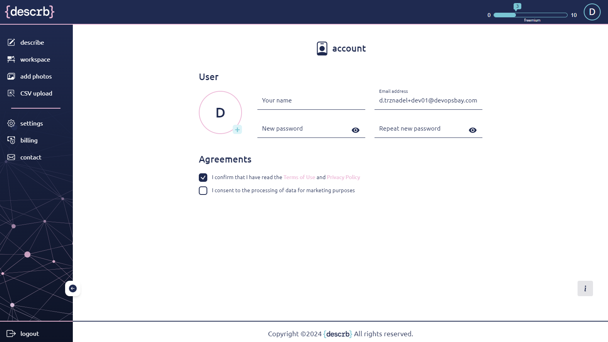

# Top bar

<figure><figcaption></figcaption></figure>

**The {descrb} logotype** in the top left corner of the top bar is a button that directs to the landing page, which also serves as a dashboard with shortcuts to various parts of the system.

**The progression bar** depicts:

* number of utilized descriptions (cloud above progression bar)
* total number of purchased descriptions (on the right side if progression bar)
* “freemium” mark (under the progression bar) if the user is on his free trial

**The initial** in the top right corner is a button that directs to the account page.
