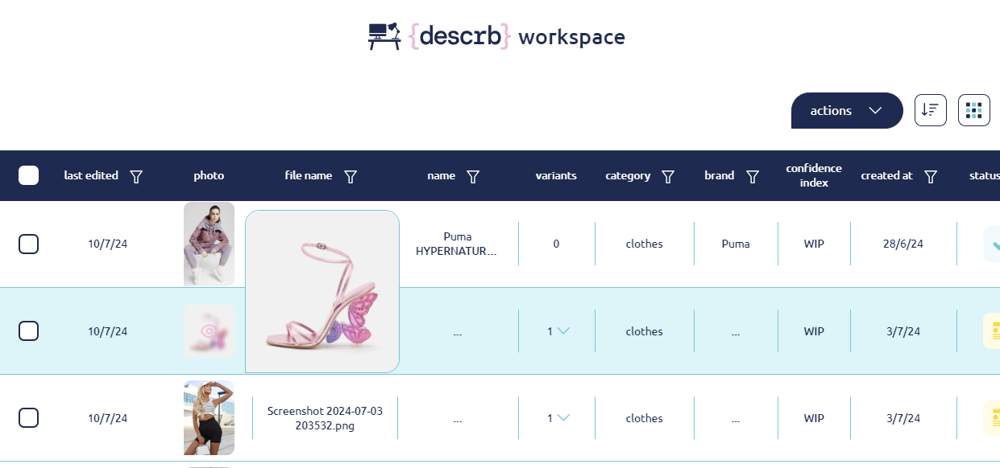
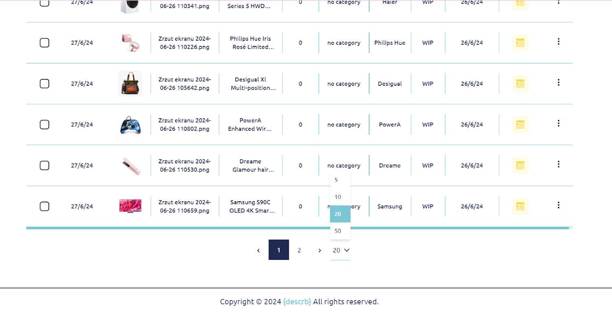

# Workspace

All descriptions are stored in this section. By default, they are displayed as a list of descriptions, but you can switch to a tile view by clicking the tile/list icon on the right side above the list.

**Workspace List View**

The list consists of several columns: last edited date, photo miniature, photo file name, product name, number of variants, category, brand, confidence index, creation date and status.

<figure><figcaption></figcaption></figure>

**Last edited** - displays the date when the basic description or its variations for the photo were last updated.

**Photo** - a photo miniature. When you hover over the photo miniature, which serves as the basic photo for a description, a larger photo preview is displayed.

<figure><figcaption></figcaption></figure>

**File name** - the original photo file name

**Name** - the name of the product generated by AI during the description process. This can be manually edited in the description details.

**Variants** - if the entire description of the photo is regenerated, optionally with changed parameters, a variant of the photo will be created. A downward dropdown menu arrow will appear next to the number indicating how many variants were generated. Clicking it will display a list of variants, showing the parameters selected to generate the description variants, the date of generation, and the status. After revealing the variants, the arrow will change to an upward arrow, allowing you to collapse the variants list.

<figure><figcaption></figcaption></figure>

**Category** - the category can be created and assigned manually by the user. This can be done through the 'edit category' option in the three dots action menu, or by selecting the checkbox and using the bulk action menu under the 'action' button above the descriptions list. Once created, the new category will be added to the category list for future selection.

<figure><figcaption></figcaption></figure>

<figure><figcaption></figcaption></figure>

<figure><figcaption></figcaption></figure>

**Brand** - the brand of the product, researched and displayed by AI during the description process if the brand search parameter is selected. It can be manually edited in the description details.

**Confidence index** - the percentage indicating AI's confidence in the accuracy of its description, based on the quality and quantity of sources gathered before creating the product description.

**Created** - the description creation date

**Status** - the status of the description:

* **In Progress** - The process of describing has started, but is not yet complete. The description cannot be displayed yet.
* **Ready** - The process of describing is finished and the description can be displayed.
* **Approved** - The description has been manually validated in the description details screen.
* **Rejected** - The description has been manually marked as "wrong product" in the description details screen.
* **Failed** - The description process has not been completed and the description is not available for viewing.

For the first few seconds of the description process, an additional stop process icon is available. If clicked by the user, it interrupts the description process and the number of remaining credits/descriptions will not be reduced.

**Actions**

All descriptions have an inline three dots action menu with the following actions to choose from. The same actions are available under the bulk dropdown action menu above the list after clicking the 'Actions' button and selecting one or more checkboxes:

* **edit category** - create new categories or select from the previously created categories list.
* **translate** - generate a translation of the selected description.
* **export** - generate and download a .csv file based on selected descriptions.
* **add photos/ replace photos** - allows you to add a photo to a description generated based on the Name or Product ID, or replace a photo with one of the variants generated in the “your photos” section.
* **remove** - delete the description and its variants.

<figure><figcaption></figcaption></figure>

<figure><figcaption></figcaption></figure>

<figure><figcaption></figcaption></figure>

<figure><figcaption></figcaption></figure>

When a description line is hovered over, it is highlighted with a distinctive color. Clicking on the line will display the description details screen.

<figure><figcaption></figcaption></figure>

**Workspace Tile View**

The tile list contains tiles with a photo preview, with the status marked in the top left corner of each tile, a checkbox in the top right corner, and an individual action menu in the bottom right corner. Each tile has a summary consisting of the product name, brand name, creation date, last edited date, and number of variants generated. Description details will be displayed after clicking on an active tile. The active tile is highlighted with a distinctive color of the product name and an enhanced status color.

<figure><figcaption></figcaption></figure>

**Sorting** - the list can be sorted using the sorting options available by clicking on the sorting icon, located between the "Actions" button and the list/tiles icon above the descriptions list. By default, the list is sorted by the last edited date, with the most recent event at the top.

&#x20;

**Filtration** - all columns with a filter icon beside the column name can be filtered. Dates are filtered using the calendar widget. The status column is filtered using checkboxes to select statuses. The category column can be filtered using the search widget or by selecting from a checkbox list of categories. Other filterable columns are filtered with a search widget.

<figure><figcaption></figcaption></figure>

<figure><figcaption></figcaption></figure>

<figure><figcaption></figcaption></figure>

<figure><figcaption></figcaption></figure>

<figure><figcaption></figcaption></figure>

**Pagination** - at the bottom of the descriptions list in the workspace screen, the available pages are displayed, indicating which page is currently shown. Users can also select how many descriptions (5, 10, 20, 50) will be displayed per page.

<figure><figcaption></figcaption></figure>

&#x20;
